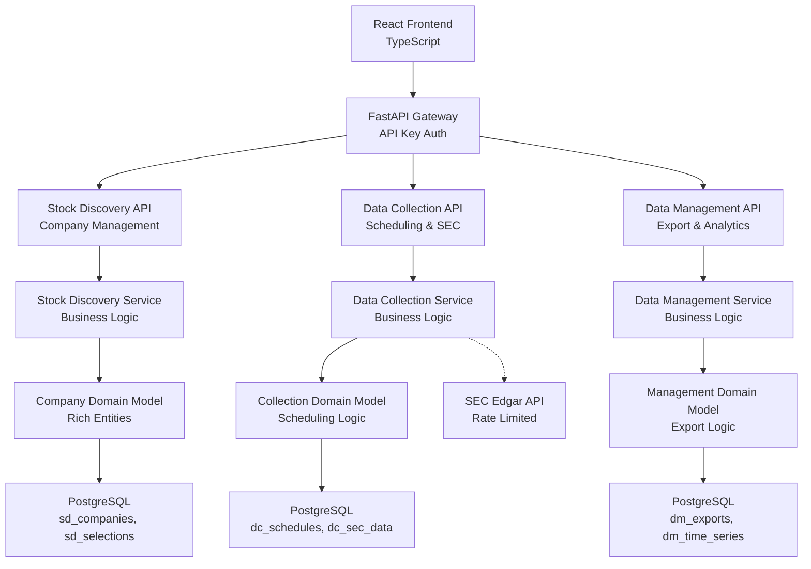

# Logical Design: US Stock Data Collection System

## 1. User Story Mapping
| User Story ID | Description | Backend Components | Frontend Components | MVP |
|---------------|-------------|-------------------|-------------------|-----|
| US-001 | Discover All Active US Stock Tickers | StockDiscoveryAPI, CompanyService, CompanyRepository | CompanyListPage, SearchBar, CompanyCard | ✅ |
| US-002 | Select Companies for Data Collection | CompanyService, CompanySelectionService | CompanySelectionPage, CheckboxList, SelectionSummary | ✅ |
| US-003 | Configure Data Collection Schedule | DataCollectionAPI, ScheduleService, SECDataFetchService | ScheduleConfigurationPage, ScheduleForm, FrequencySelector | ✅ |
| US-004 | Monitor Financial Report Dates | ReportDateService, SECDataRepository | ReportCalendarPage, DateTimeline, NotificationPanel | ❌ |
| US-005 | View Time-Series Data History | DataManagementAPI, TimeSeriesService | HistoryViewerPage, DateRangePicker, DataChart | ❌ |
| US-006 | Export and Manage Collected Data | ExportService, DataExportRepository | ExportPage, FormatSelector, DownloadButton | ❌ |

## 2. Non-Functional Requirements
| Category | Requirement | Technical Impact | User Story |
|----------|-------------|------------------|------------|
| Performance | API responses under 500ms for most queries | Database indexing, query optimization, response caching | US-001, US-002 |
| Security | API key authentication for all endpoints | FastAPI middleware, key management, secure storage | All stories |
| Scalability | Support for 1000+ companies with time-series data | Efficient PostgreSQL schema, time-series optimization | US-003, US-005 |
| Availability | 95% uptime during market hours | Error handling, retry logic, monitoring | All stories |
| Data Integrity | Ensure SEC data accuracy and consistency | Validation at multiple layers, transaction boundaries | US-003, US-004 |

## 3. Project Structure

### 3.1 Directory Layout
```
Monolith Structure with Bounded Context Organization:
project-root/
├── backend/
│   ├── app/
│   │   ├── api/
│   │   │   ├── stock_discovery/
│   │   │   ├── data_collection/
│   │   │   └── data_management/
│   │   ├── services/
│   │   │   ├── stock_discovery/
│   │   │   ├── data_collection/
│   │   │   └── data_management/
│   │   ├── domain/
│   │   │   ├── stock_discovery/
│   │   │   ├── data_collection/
│   │   │   └── data_management/
│   │   ├── infrastructure/
│   │   │   ├── database/
│   │   │   ├── external/
│   │   │   └── security/
│   │   └── shared/
│   │       ├── exceptions/
│   │       ├── validation/
│   │       └── models/
│   ├── migrations/
│   └── tests/
├── frontend/
│   ├── src/
│   │   ├── components/
│   │   ├── pages/
│   │   ├── services/
│   │   └── utils/
├── docker-compose.yml
└── README.md
```

### 3.2 Key Directories
- **Backend API**: `/backend/app/api/` - FastAPI route definitions by bounded context
- **Backend Services**: `/backend/app/services/` - Application service layer orchestrating domain logic
- **Backend Domain**: `/backend/app/domain/` - Rich domain models and business logic
- **Frontend Components**: `/frontend/src/components/` - React components by user story
- **Frontend Pages**: `/frontend/src/pages/` - Complete user interfaces for each story
- **Database**: `/backend/migrations/` - Alembic migration scripts for PostgreSQL
- **Configuration**: `/docker-compose.yml` - Development and production environment setup

## 4. Technical Architecture

### 4.1 Architecture Pattern
- **Choice**: Monolith with modular bounded context organization
- **Reasoning**: Single-user system with focused requirements, simplifies development and deployment while maintaining clear domain boundaries

### 4.2 Technology Stack
| Category | Choice | Source |
|----------|--------|--------|
| Frontend | React + TypeScript | Domain decomposition decision 3-A |
| Backend | Python + FastAPI | Domain decomposition decision 2-A |
| Database | PostgreSQL | Domain decomposition decision 4-B |
| Integration | RESTful API with OpenAPI | Logical design decision 1-A |

### 4.3 Architecture Diagram


### 4.4 Component Overview
- **Frontend**: React components providing user interfaces for company discovery, schedule configuration, and data management
- **Backend API**: FastAPI routes organized by bounded contexts with OpenAPI documentation
- **Backend Services**: Application services orchestrating domain operations and external integrations
- **Domain Layer**: Rich domain models with business logic, validation, and invariants
- **Data Layer**: SQLAlchemy repositories with PostgreSQL database using table prefixes

### 4.5 Data Flow
1. **User Action**: User interacts with React frontend component
2. **Frontend Processing**: Component validates input and calls appropriate API endpoint
3. **API Gateway**: FastAPI validates API key and routes to appropriate context controller
4. **Service Layer**: Application service orchestrates domain operations and repositories
5. **Domain Logic**: Rich domain entities enforce business rules and invariants
6. **Data Operations**: SQLAlchemy repositories perform database operations with PostgreSQL
7. **External Integration**: Domain services interact with SEC Edgar API for data collection
8. **Response Flow**: Results flow back through domain → service → API → frontend

## 5. Backend Design

### 5.1 API Specification
| Endpoint | Method | Purpose | User Story | MVP |
|----------|--------|---------|------------|-----|
| `/api/v1/companies` | GET | List all active US stock tickers | US-001 | ✅ |
| `/api/v1/companies/search` | GET | Search companies by ticker or name | US-001 | ✅ |
| `/api/v1/companies/{id}/select` | POST | Select company for data collection | US-002 | ✅ |
| `/api/v1/companies/{id}/deselect` | POST | Remove company from tracking | US-002 | ✅ |
| `/api/v1/companies/selected` | GET | List selected companies | US-002 | ✅ |
| `/api/v1/schedules` | GET | List collection schedules | US-003 | ✅ |
| `/api/v1/schedules` | POST | Create collection schedule | US-003 | ✅ |
| `/api/v1/schedules/{id}` | PUT | Update collection schedule | US-003 | ✅ |
| `/api/v1/schedules/{id}/activate` | POST | Activate/deactivate schedule | US-003 | ✅ |
| `/api/v1/reports/dates` | GET | Get upcoming financial report dates | US-004 | ❌ |
| `/api/v1/data/history` | GET | Get time-series data for company | US-005 | ❌ |
| `/api/v1/exports` | POST | Request data export | US-006 | ❌ |
| `/api/v1/exports/{id}/download` | GET | Download exported file | US-006 | ❌ |

### 5.2 Data Models
| Entity | Key Attributes | Relationships | Table Name |
|--------|----------------|---------------|------------|
| Company | id, ticker_symbol, company_name, exchange, sector, is_selected | One-to-many with SelectionSchedule | sd_companies |
| CollectionSchedule | id, company_id, schedule_type, interval_hours, next_run_time, is_active | Many-to-one with Company | dc_schedules |
| SECData | id, company_id, filing_type, filing_date, accession_number, data_content | Many-to-one with Company | dc_sec_data |
| TimeSeriesData | id, company_id, data_type, timestamp, value | Many-to-one with Company | dm_time_series |
| DataExport | id, company_id, date_range, export_format, status, file_path | Many-to-one with Company | dm_exports |

### 5.3 Business Logic
- **StockDiscoveryService**: Company discovery, selection management, search functionality
- **CollectionScheduleService**: Schedule creation, activation, next run calculation, execution coordination
- **SECDataFetchService**: SEC Edgar API integration, rate limiting, data parsing and validation
- **DataExportService**: Export processing, file generation, format handling
- **CompanyRepository**: Company data access with selection tracking
- **ScheduleRepository**: Schedule management with timing constraints
- **SECDataRepository**: SEC filing storage with efficient querying
- **TimeSeriesRepository**: Time-series data with date-range optimization

### 5.4 Error Handling
| Error Type | Handling Strategy | User Experience | User Story |
|------------|------------------|-----------------|------------|
| Validation Error | Pydantic model validation with detailed error messages | Form validation with field-specific error messages | All stories |
| Authentication Error | API key middleware returns 401 with proper headers | Login prompt or error notification | All stories |
| Business Rule Error | Domain exceptions with clear business language | User-friendly error explaining constraint | US-002, US-003 |
| External API Error | SEC API retry logic with exponential backoff | "Data temporarily unavailable" notification | US-003, US-004 |
| Database Error | Transaction rollback with logging | "System error, please try again" | All stories |

## 6. Frontend Design

### 6.1 UI Components
| Component | Purpose | Key Props | User Story |
|-----------|---------|-----------|------------|
| CompanyList | Display searchable list of companies | companies, onCompanySelect, searchQuery | US-001 |
| CompanyCard | Show individual company information | company, isSelected, onSelect | US-001, US-002 |
| ScheduleForm | Configure data collection schedule | companyId, schedule, onSave | US-003 |
| DateRangePicker | Select date range for data viewing | startDate, endDate, onChange | US-005 |
| ExportDialog | Configure and request data export | companies, formats, onExport | US-006 |

### 6.2 User Flows
| Flow | Steps | Components Involved | User Story |
|------|-------|-------------------|------------|
| Company Discovery | Search → Browse → Select | CompanyList → CompanyCard → SelectionPanel | US-001 → US-002 |
| Schedule Configuration | Select Company → Configure Frequency → Activate | CompanySelector → ScheduleForm → ActivationToggle | US-003 |
| Data Export | Select Companies → Choose Format → Download | CompanyMultiSelect → ExportDialog → DownloadButton | US-006 |

### 6.3 State Management
- **Global State**: Selected companies, active schedules, authentication status
- **Local State**: Search queries, form inputs, UI loading states
- **API Integration**: Axios client with automatic API key injection and error handling

## 7. Integration Design

### 7.1 Internal Integration
- **Service Communication**: Direct method calls between application services within same process
- **Data Synchronization**: Database transactions ensure ACID properties across related operations
- **Error Propagation**: Structured exception handling with proper error codes and messages

### 7.2 External Integration
- **SEC Edgar API**: HTTP client with rate limiting (10 requests/second), retry logic, and error handling
- **Authentication**: Static API key passed via X-API-Key header for all requests
- **Data Exchange**: JSON responses with automatic parsing to domain models via Pydantic

## 8. MVP Implementation Plan

### Phase 1: Core Backend (Runnable)
**User Stories**: US-001, US-002, US-003
- [ ] PostgreSQL database setup with migrations
- [ ] FastAPI application with basic structure
- [ ] Company domain model and repository
- [ ] Stock discovery API endpoints
- [ ] Company selection functionality
- [ ] Schedule management with basic timing
- [ ] API key authentication middleware

### Phase 2: Core Frontend (Testable)
**User Stories**: US-001, US-002, US-003
- [ ] React application with TypeScript setup
- [ ] Company discovery and search interface
- [ ] Company selection management UI
- [ ] Schedule configuration forms
- [ ] API client integration with authentication
- [ ] Basic error handling and user feedback

### Phase 3: Integration & Polish
**User Stories**: All MVP stories
- [ ] End-to-end testing with real SEC API
- [ ] Docker development environment
- [ ] Comprehensive error handling
- [ ] User experience improvements
- [ ] Documentation and deployment guides

## 9. Local Development Setup
- **Prerequisites**: Python 3.11+, Node.js 18+, Docker & Docker Compose, PostgreSQL 15+
- **Environment Setup**:
  - Backend: `cd backend && python -m venv venv && source venv/bin/activate && pip install -r requirements.txt`
  - Database: `docker-compose up -d postgres`
  - Frontend: `cd frontend && npm install`
- **Development Workflow**:
  - Backend: `uvicorn app.main:app --reload` for FastAPI development server
  - Frontend: `npm start` for React development server
  - Database: Alembic migrations for schema management
- **Testing Strategy**:
  - Backend: Pytest with domain unit tests and API integration tests
  - Frontend: Jest with component unit tests and E2E integration tests
  - Database: Test containers for isolated testing

## 10. Validation Checklist
- [x] All MVP user stories have technical specifications
- [x] Non-functional requirements are addressed in design
- [x] All user interactions have corresponding UI components
- [x] All business operations have backend implementations
- [x] Frontend and backend integration is defined
- [x] Data models support all required operations
- [x] Error handling is specified for all failure scenarios
- [x] Technology choices align with architecture decisions
- [x] Integration points are clearly defined
- [x] MVP scope is clearly defined and achievable
- [x] Local development approach is specified

---

## Design Rationale Summary

This logical design provides a complete technical blueprint for implementing the US Stock Data Collection System with:

1. **Clear Architecture**: Monolith structure with bounded context organization aligns with domain design
2. **Comprehensive API**: RESTful endpoints covering all MVP user stories with OpenAPI documentation
3. **Efficient Data Layer**: PostgreSQL schema with proper indexing and relationships for time-series data
4. **Robust Security**: API key authentication appropriate for single-user system
5. **Scalable Foundation**: Design supports future growth while maintaining simplicity for MVP
6. **Complete Integration**: Clear patterns for React-FastAPI communication and external API integration