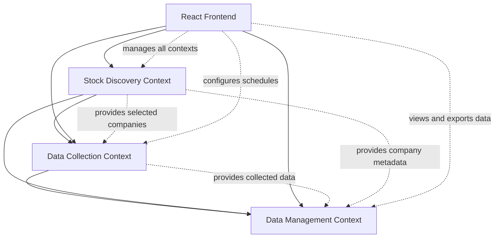

# Domain Decomposition: US Stock Data Collection System

## 1. Architecture Decision

**Chosen Architecture**: Monolith - Single application with modular internal structure
**Communication Pattern**: Internal APIs and module boundaries within single application
**Data Strategy**: Shared PostgreSQL database with clear module boundaries and data access patterns

### Decision Analysis
**Complexity Factors Analyzed**:
- **Domain Complexity**: 3 distinct business domains identified (Stock Discovery, Data Collection, Data Management)
- **Team Size**: Single user development team
- **Scalability Requirements**: Moderate - single user with potential for future growth
- **Integration Needs**: Primary integration with SEC Edgar API, extensible for future data sources
- **Operational Capability**: Single developer with basic operational needs

**Decision Criteria Applied**:
- [x] Single user system with focused requirements
- [x] Rapid development and deployment priority
- [x] Simple operational overhead desired
- [ ] High scalability requirements not identified for MVP
- [ ] Multiple development teams not present

**Rationale**: Monolith architecture because this is a single-user system where simplicity, rapid development, and ease of maintenance are prioritized over distributed system complexity

## 2. Bounded Context Boundaries

### Stock Discovery Context
**Domain Area**: Stock ticker discovery and company selection management
**Responsibilities**:
- Discover and maintain list of all active US stock tickers
- Enable user to select companies for tracking
- Manage selection flags and company metadata

**User Stories Covered**: US-001 (Discover All Active US Stock Tickers), US-002 (Select Companies for Data Collection)

**Key Entities**:
- StockTicker (ticker symbol, company name, exchange, sector)
- CompanySelection (ticker_id, selected_flag, selection_date)
- CompanyMetadata (industry, market_cap, description)

**Monolith: Module Name**: stock_discovery module

---

### Data Collection Context
**Domain Area**: Automated SEC Edgar data collection and scheduling
**Responsibilities**:
- Configure and manage data collection schedules
- Execute SEC Edgar API calls for selected companies
- Handle hybrid scheduling (fixed + event-driven)
- Store time-series collection data with rolling window

**User Stories Covered**: US-003 (Configure Data Collection Schedule), US-004 (Monitor Financial Report Dates)

**Key Entities**:
- CollectionSchedule (company_id, interval_type, next_run, active_flag)
- SECData (company_id, filing_type, filing_date, data_content, collection_timestamp)
- FinancialReportDates (company_id, report_type, expected_date, actual_date)

**Monolith: Module Name**: data_collection module

---

### Data Management Context
**Domain Area**: Data viewing, export, and historical management
**Responsibilities**:
- Provide time-series data viewing interfaces
- Handle data export functionality
- Manage rolling window data retention
- Support data cleanup and archival operations

**User Stories Covered**: US-005 (View Time-Series Data History), US-006 (Export and Manage Collected Data)

**Key Entities**:
- DataExport (export_id, company_id, date_range, format, file_path, created_date)
- DataRetention (data_type, retention_days, archive_date)
- DataUsage (storage_usage, record_count, last_calculated)

**Monolith: Module Name**: data_management module

---

## 3. Data Ownership

| Bounded Context | Owned Data | Read Access | Write Access |
|-----------------|------------|-------------|--------------|
| **Stock Discovery** | StockTicker, CompanySelection, CompanyMetadata | All contexts | Stock Discovery only |
| **Data Collection** | CollectionSchedule, SECData, FinancialReportDates | All contexts | Data Collection only |
| **Data Management** | DataExport, DataRetention, DataUsage | All contexts | Data Management only |

## 4. Business Rules

- **Company Selection Rule**: Stock Discovery context enforces that only companies with selected_flag=true are processed by Data Collection
- **Data Retention Rule**: Data Management context enforces rolling window policy based on collection timestamps
- **Scheduling Rule**: Data Collection context enforces hybrid scheduling with fixed intervals and event-driven triggers
- **Export Rule**: Data Management context enforces that only data for selected companies can be exported

## 5. Integration Patterns

### Key Process Flows

#### Stock Discovery to Data Collection Flow
```
1. Stock Discovery → Company selection update → Data Collection
2. Stock Discovery → New company metadata → Data Collection
```

#### Data Collection to Data Management Flow
```
1. Data Collection → New SEC data collected → Data Management
2. Data Collection → Collection timestamp → Data Management (for retention)
```

#### Data Management to User Interface Flow
```
1. Data Management → Processed time-series data → React Frontend
2. Data Management → Export functionality → React Frontend
```

## 6. Context Map

### Dependencies Diagram



### Relationship Types
- **Stock Discovery → Data Collection**: Provides list of selected companies and metadata for collection scheduling
- **Stock Discovery → Data Management**: Provides company information for data organization and export
- **Data Collection → Data Management**: Provides collected SEC data with timestamps for storage and retention management
- **React Frontend → All Contexts**: Provides user interface for managing all system functionality

## 7. Implementation Strategy

### Phase 1: Core Bounded Contexts (MVP)
1. **Stock Discovery Context** - Company discovery and selection functionality
2. **Data Collection Context** - Basic SEC Edgar data collection and scheduling

### Phase 2: Supporting Bounded Contexts
3. **Data Management Context** - Time-series viewing and basic export functionality
4. **React Frontend Integration** - User interface for all contexts

### Phase 3: Integration & Testing
- Context integration patterns
- Cross-context business processes
- End-to-end testing with Docker deployment
- Rolling window data retention implementation

## 8. Success Criteria

- [x] Architecture decision analysis completed with clear criteria
- [x] Bounded context boundaries clearly defined
- [x] Data ownership matrix completed
- [x] Key business rules identified and assigned to contexts
- [x] Integration patterns designed between contexts
- [x] Context map showing relationships
- [x] Implementation strategy defined per bounded context

## 9. Future Considerations

### Post-MVP Enhancements
- **Notification Context**: Real-time alerts for new filings and report dates
- **Analytics Context**: Advanced data analysis and trend identification
- **API Integration Context**: Support for additional data sources (Yahoo Finance, Alpha Vantage)

### Evolution Path
- Module boundaries support future extraction to microservices if needed
- Clear data ownership enables easier database splitting
- React frontend can evolve to separate SPA deployment
- Docker containerization supports scaling and deployment flexibility